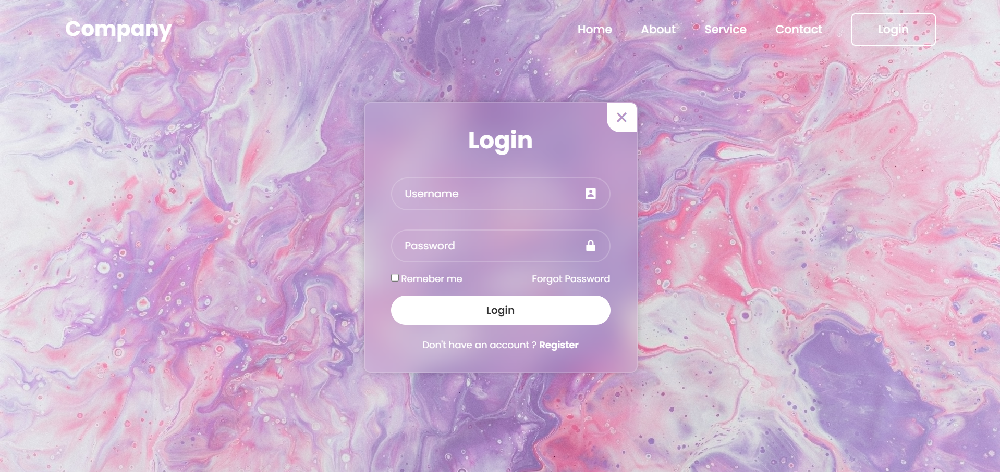

# Simple Login Page

A basic login page created using HTML, CSS, and JavaScript.

## Features

- Simple and clean design
- Username and password input fields
- Basic client-side validation

## Demo



## Getting Started

To get a local copy up and running, follow these simple steps.

### Prerequisites

You will need a web browser to open the HTML file.

### Installation

1. Clone the repo

   ```sh
   git clone github
